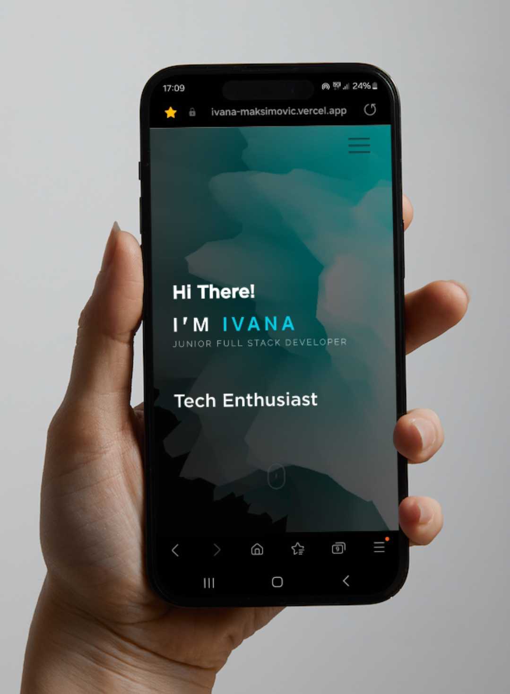

# Portfolio Website - Ivana Maksimovic

Welcome to my portfolio website built with ReactJS, Three.js, and hosted on Vercel




## Overview

This project showcases my portfolio and allows visitors to view my work and send me messages directly through the website.


## Installation

To run this project locally, follow these steps:

1. Clone the repository:

   ```bash
   git clone https://github.com/SheLearningCode/ivana-maksimovic.git
   ```

2. Navigate to the project directory:

    ```bash
    cd portfolio
    ```

3. Install the dependencies:

    ```bash
    npm install
    ```

4. Start the React app:

    ```bash
    npm start
    ```

5. Open your web browser and visit <http://localhost:5173/> to view the project locally.


### Tech-Stack:


### ReactJS

- **Why**: ReactJS was chosen for its component-based architecture, virtual DOM rendering, and strong community support, making it ideal for building interactive and responsive user interfaces.
- **Advantages**: Faster rendering performance, reusable components, efficient updates with virtual DOM, large ecosystem of libraries and tools.
- **Disadvantages**: Steeper learning curve for beginners, complex state management in larger applications.


### Three.js 

- **Why**: Three.js was selected for its powerful capabilities in 3D graphics rendering, allowing for the creation of visually appealing and interactive elements in the portfolio.
- **Advantages**: Cross-platform compatibility, extensive documentation and examples, support for WebGL and Canvas rendering.
- **Disadvantages**: Requires understanding of 3D concepts and mathematics, potential performance overhead with complex scenes.


### EmailJs 

- **Why**: EmailJs simplifies the handling of form submissions and email sending, providing a seamless communication channel between visitors and the website owner.
- **Advantages**: Easy integration with frontend applications, support for custom email templates, secure handling of email submissions.
- **Disadvantages**: Limited customization options compared to self-hosted email servers, potential reliance on third-party service availability.


### dotenv 

- **Why**: dotenv is used to manage environment variables, ensuring sensitive information such as API keys and database credentials are kept secure.
- **Advantages**: Simplifies configuration management, improves security by preventing sensitive data exposure.
- **Disadvantages**: Adds overhead for managing additional configuration files, potential risk of misconfiguration.


### Mui (Material-UI) 

- **Why**: Material-UI offers a wide range of pre-designed UI components and styles, enabling rapid development and consistent design across the portfolio.
- **Advantages**: Rich set of customizable components, adherence to Material Design principles, active community and ongoing development.
- **Disadvantages**: Higher bundle size compared to custom-styled components, potential design limitations for highly customized interfaces.


### react-lazy 

- **Why**: React Lazy allows for dynamic loading of components, improving initial page load time and reducing bundle size by loading components only when needed.
- **Advantages**: Improved performance with code splitting, reduced bundle size for faster page loads.
- **Disadvantages**: Requires careful implementation to avoid performance issues, may not be suitable for all applications.


### react-three-fiber 

- **Why**: react-three-fiber provides a React renderer for Three.js, enabling the creation of interactive 3D scenes with the simplicity of React components.
- **Advantages**: Seamless integration with React, declarative API for building complex 3D scenes, extensive documentation and examples.
- **Disadvantages**: Learning curve for beginners, potential performance overhead with complex scenes.


### Bootstrap 5 

- **Why**: Bootstrap 5 offers a comprehensive set of CSS and JavaScript components, providing a responsive and mobile-first design framework for building modern websites.
- **Advantages**: Rapid development with pre-styled components, responsive design out-of-the-box, extensive documentation and community support.
- **Disadvantages**: Limited customization compared to custom CSS, risk of websites looking similar due to common Bootstrap styles.


### framer-motion

- **Why**: framer-motion is a library for creating fluid animations and interactions in React applications, enhancing the user experience with visually appealing effects.
- **Advantages**: Declarative API for creating complex animations, support for gestures and transitions, high performance with minimal overhead.
- **Disadvantages**: Learning curve for beginners, potential complexity in managing state and animation timing.


## Considerations

- **To-Dos**: 
- Create own 3D models to showcase unique and personalized content.
- Implement scalability considerations and best practices to ensure the website can handle increased traffic and maintain performance under load.
- Explore additional features such as user authentication, content management system (CMS) integration, and analytics tracking to enhance functionality and user experience.
- Continuously update and refine the portfolio with new projects and achievements to keep it relevant and engaging
- as dotenv is actually not secure enough as sensitive data can be easily seen with help of web-dev-tools it would be better using Backend APIs: Instead of directly exposing sensitive data to the client-side code, implement backend APIs that handle requests for sensitive information. The client-side code can then communicate with these APIs to fetch the required data securely


## Contact

If you have any questions, feedback, or would like to get in touch with me, you can use the contact form on my portfolio or email me at <maksimovic.ivana@protonmail.com>


## License

This project is licensed under the MIT License - see the LICENSE file for details.
