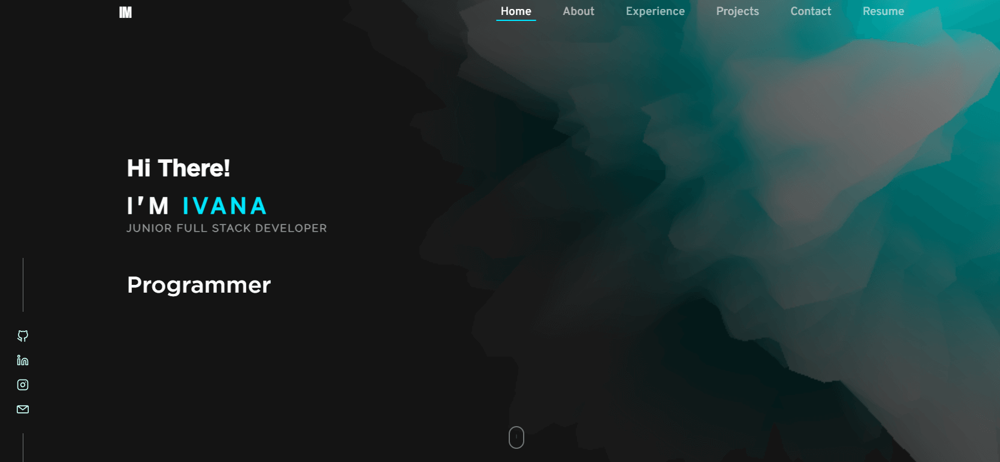

# Portfolio Website - Ivana Maksimovic

Welcome to my portfolio website built with ReactJS, Three.js, and hosted on Vercel




## Overview

This project showcases my portfolio and allows visitors to view my work and send me messages directly through the website.


## Installation

To run this project locally, follow these steps:

1. Clone the repository:

   ```bash
   git clone https://github.com/SheLearningCode/ivana-maksimovic.git
   ```

2. Navigate to the project directory:

    ```bash
    cd portfolio
    ```

3. Install the dependencies:

    ```bash
    npm install
    ```

4. Start the React app:

    ```bash
    npm start
    ```

5. Open your web browser and visit <http://localhost:5173/> to view the project locally.

## Features

- ReactJS: The frontend is built using ReactJS, making it highly interactive and responsive

- Three.js: Three.js is used for 3D graphics rendering, adding a visually appealing aspect to the portfolio

- EmailJs: The website uses EmailJs to handle form submissions and send emails to private mail adress 


## Contact

If you have any questions, feedback, or would like to get in touch with me, you can use the contact form on my portfolio or email me at <maksimovic.ivana@protonmail.com>

## License

This project is licensed under the MIT License - see the LICENSE file for details.
